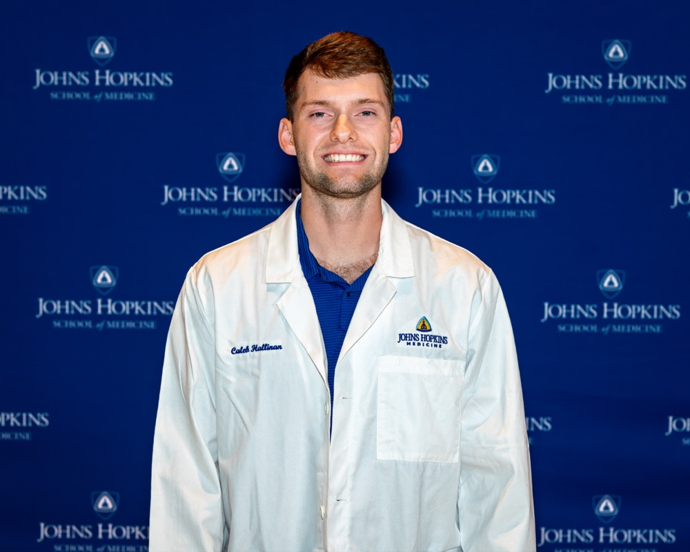

::::: {.hero}
:::: {.hero-text}
<h1 class="hero-name">Caleb Hallinan</h1>

[Biomedical Engineering PhD Candidate · Johns Hopkins University]{.hero-role}

I am a PhD candidate in Biomedical Engineering at Johns Hopkins University, working in the
[JEFworks Lab](https://jef.works/) under the mentorship of Dr. Jean Fan, where I develop machine learning and computational methods for
spatial transcriptomics, digital pathology, and tissue-scale biological analysis. I care about
building practical, reproducible, open-source tools that help biologists make sense of complex
tissues.

::: {.social-links}
[ GitHub](https://github.com/calebhallinan)
[ Scholar](https://scholar.google.com/citations?user=jqY4-LcAAAAJ&hl=en)
[ ORCID](https://orcid.org/0009-0000-9137-1293)
[ LinkedIn](https://www.linkedin.com/in/calebhallinan/)
[ Twitter/X](https://twitter.com/caleb_hallinan)
[ Email](mailto:challin1@jh.edu)
[ CV](cv.html)
:::
::::

:::: {.hero-photo}
{fig-alt="Caleb Hallinan wearing a Johns Hopkins Medicine white coat"}
::::
:::::

::: {.section-heading-row}
## Research {#research}
[All Research →](research.qmd){.section-link}
:::

::: {.section-intro}
My research sits at the intersection of machine learning and tissue biology, with an emphasis on
making spatial and imaging technologies more accurate, interpretable, and usable.
:::

::: {.research-grid}
::: {.research-card data-motif="spatial"}
### Spatial transcriptomics
Computational analysis and benchmarking of imaging- and sequencing-based spatial transcriptomics
data to study the spatial organization of tissues.
:::

::: {.research-card data-motif="histology"}
### Digital pathology & deep learning
Predicting spatial gene expression from H&E histology images, and understanding how data quality
shapes model performance and interpretability.
:::

::: {.research-card data-motif="probes"}
### Data & probe quality
Assessing measurement fidelity in spatial platforms, including off-target probe binding, to improve
the biological interpretability of spatial data.
:::

::: {.research-card data-motif="subtypes"}
### Subtype discovery
Feature-selection and metric-learning methods that preserve heterogeneity to uncover disease and
cell-state subtypes from transcriptomic data.
:::

::: {.research-card data-motif="livecell"}
### Live-cell image analysis
Deep learning for cell segmentation, tracking, and morphodynamic profiling of live-cell imaging.
:::

::: {.research-card data-motif="software"}
### Open-source software
Building user-friendly, reproducible computational tools for biologists who may not be
programmers.
:::
:::

::: {.section-heading-row}
## Selected Works {#publications}
[All Publications →](publications.qmd){.section-link}
:::

::: {.section-intro}
First-author publications. Names in **bold** indicate me; an asterisk (\*) denotes co-first
authorship. See [All Publications](publications.qmd) for the complete list.
:::

::: {.pub-list}
::: {.pub}
::: {.pub-title}
[Evidence of off-target probe binding affecting 10x Genomics Xenium gene panels compromise accuracy of spatial transcriptomic profiling](https://elifesciences.org/articles/107070)
:::
::: {.pub-authors}
[Hallinan C]{.me}, Ji HJ, Tsou E, Salzberg SL, Fan J
:::
::: {.pub-venue}
eLife, 2026 [Journal]{.pub-tag}
:::
::: {.pub-links}
[eLife](https://elifesciences.org/articles/107070)
[DOI](https://doi.org/10.7554/eLife.107070.3)
[Code](https://github.com/JEFworks-Lab/off-target-probe-tracker)
:::
:::

::: {.pub}
::: {.pub-title}
[Impact of Data Quality on Deep Learning Prediction of Spatial Transcriptomics from Histology Images](https://www.biorxiv.org/content/10.1101/2025.09.04.674228v1)
:::
::: {.pub-authors}
[Hallinan C]{.me}, Lucas C-HG, Fan J
:::
::: {.pub-venue}
bioRxiv, 2025 [Preprint]{.pub-tag}
:::
::: {.pub-links}
[Preprint](https://www.biorxiv.org/content/10.1101/2025.09.04.674228v1)
[PDF](https://www.biorxiv.org/content/10.1101/2025.09.04.674228v1.full.pdf)
[DOI](https://doi.org/10.1101/2025.09.04.674228)
<!-- TODO: add Code link when the repository is public -->
:::
:::

::: {.pub}
::: {.pub-title}
[Heterogeneity-preserving discriminative feature selection for disease-specific subtype discovery (PHet)](https://www.nature.com/articles/s41467-025-58718-1)
:::
::: {.pub-authors}
M A Basher AR\*, [Hallinan C]{.me}\*, Lee K
:::
::: {.pub-venue}
Nature Communications, 2025 [Journal]{.pub-tag}
:::
::: {.pub-links}
[Article](https://www.nature.com/articles/s41467-025-58718-1)
[DOI](https://doi.org/10.1038/s41467-025-58718-1)
[Code](https://github.com/kleelab-bch/phet)
:::
:::
:::

::: {.section-heading-row}
## Featured Software {#software}
[All Software →](software.qmd){.section-link}
:::

::: {.section-intro}
Open-source tools for spatial and imaging-based transcriptomics. More on my
[GitHub](https://github.com/calebhallinan).
:::

::: {.software-grid}
::: {.software-item}
### Off-target Probe Tracker (OPT)
A tool associated with the Xenium off-target probe binding work for identifying putative
off-target probe binding through sequence-alignment-based analysis.

::: {.software-links}
::: {.pub-links}
[GitHub](https://github.com/JEFworks-Lab/off-target-probe-tracker)
:::
[Manuscript](https://elifesciences.org/articles/107070){.btn-accent-sm}
:::
:::

::: {.software-item}
### P-Het
Software for Preserving Heterogeneity / subtype discovery from transcriptomic data, associated
with the Nature Communications P-Het paper.

::: {.software-links}
::: {.pub-links}
[GitHub](https://github.com/kleelab-bch/phet)
:::
[Manuscript](https://doi.org/10.1038/s41467-025-58718-1){.btn-accent-sm}
:::
:::

::: {.software-item}
### SpatialMNN
spatialMNN, an algorithm that integrates multiple spatial transcriptomic samples and identifies
spatial domains.
<!-- TODO: clarify Caleb's specific role/contribution to this project once confirmed. -->

::: {.software-links}
::: {.pub-links}
[GitHub](https://github.com/Pixel-Dream/spatialMNN)
:::
[Manuscript](https://doi.org/10.1093/bioinformatics/btaf403){.btn-accent-sm}
:::
:::

::: {.software-item}
### STARIT
Converts transcripts within segmented cells in imaging-based spatial transcriptomics data into
rasterized image tensors, enabling deep-learning models to characterize cell states from
subcellular molecular heterogeneity rather than gene counts alone.

::: {.software-links}
::: {.pub-links}
[GitHub](https://github.com/JEFworks-Lab/STARIT)
:::
[Manuscript](https://www.biorxiv.org/content/10.64898/2025.12.18.695193v1){.btn-accent-sm}
:::
:::
:::

::: {.section-heading-row}
## News {#news}
[All News →](news.qmd){.section-link}
:::

::: {.news-list}
::: {.news-item}
::: {.news-date}
Jun 2026
:::
::: {.news-body}
Attended the HuBMAP Final Hurrah and Spatial Biology meetings at the NIH.

::: {.tag-row}
[Milestone]{.tag}
:::
:::
:::

::: {.news-item}
::: {.news-date}
May 2026
:::
::: {.news-body}
Version of record published in **eLife**: [off-target probe binding in 10x Genomics Xenium gene panels](https://elifesciences.org/articles/107070), introducing the [Off-target Probe Tracker (OPT)](https://github.com/JEFworks-Lab/off-target-probe-tracker) tool.

::: {.tag-row}
[Publication]{.tag}
:::
:::
:::

::: {.news-item}
::: {.news-date}
Dec 2025
:::
::: {.news-body}
New bioRxiv preprint, [STARIT](https://www.biorxiv.org/content/10.64898/2025.12.18.695193v1), characterizing cell states with subcellular molecular heterogeneity in spatial transcriptomics data.

::: {.tag-row}
[Publication]{.tag}
:::
:::
:::

::: {.news-item}
::: {.news-date}
Apr 2025
:::
::: {.news-body}
**[PHet](https://doi.org/10.1038/s41467-025-58718-1)** published in *Nature Communications* — a heterogeneity-preserving feature-selection method for disease-specific subtype discovery (co-first author).

::: {.tag-row}
[Publication]{.tag}
:::
:::
:::
:::

::: {.section-heading-row}
## Teaching {#teaching}
[All Teaching →](teaching.qmd){.section-link}
:::

::: {.section-intro}
I care deeply about teaching and mentorship, with a long-term goal of becoming a teaching
professor. I currently mentor two students and have designed and taught two original courses on
neural networks and deep learning for spatial transcriptomics, in addition to five teaching
assistant roles at Johns Hopkins, Harvard Medical School, and the University of Virginia. See
[Teaching & Mentorship](teaching.qmd) for the complete history.
:::

## Experience & Education {#experience}

:::: {.cv-columns}
::: {.cv-block}
### Education

::: {.cv-entry}
::: {.cv-text}
[PhD, Biomedical Engineering]{.role}
[Johns Hopkins University — JEFworks Lab (Advisor: [Jean Fan](https://jef.works/)), Baltimore, MD]{.place}
:::
[Aug 2023 – Present]{.date}
:::

::: {.cv-entry}
::: {.cv-text}
[B.A., Statistics & Biology]{.role}
[University of Virginia, Charlottesville, VA]{.place}
:::
[2017 – 2021]{.date}
:::
:::

::: {.cv-block}
### Experience

::: {.cv-entry}
::: {.cv-text}
[Research Assistant II]{.role}
[Boston Children's Hospital & Harvard Medical School — Lee Lab (Advisor: [Kwonmoo Lee](https://labs.childrenshospital.org/kwonmoo-lee)), Boston, MA]{.place}
:::
[Sep 2021 – Jun 2023]{.date}
:::

::: {.cv-entry}
::: {.cv-text}
[Undergraduate Researcher]{.role}
[University of Virginia (Advisors: [Tianxi Li](https://sites.google.com/view/tianxili-homepage/home), [Frederic Padilla](https://www.linkedin.com/in/fredericpadilla/)), Charlottesville, VA]{.place}
:::
[2018 – 2021]{.date}
:::
:::
::::

## Contact {#contact}

The best way to reach me is by [email](mailto:challin1@jh.edu). You can also find me on
[GitHub](https://github.com/calebhallinan),
[Google Scholar](https://scholar.google.com/citations?user=jqY4-LcAAAAJ&hl=en),
[ORCID](https://orcid.org/0009-0000-9137-1293), and
[LinkedIn](https://www.linkedin.com/in/calebhallinan/), or download my [CV](cv.html).
